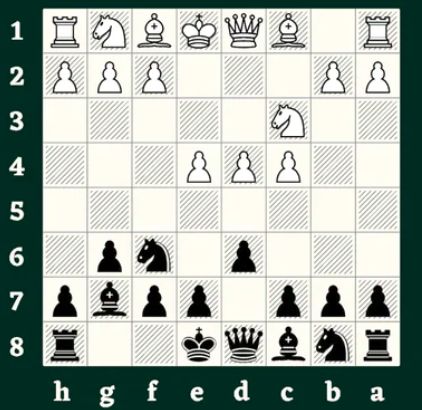

# Mini CV

* Présentation: Xavier CARROLAGGI, 37 ans, actuellement Manipulateur radio au sein de **l'hopital de la Miséricorde**, en reconversion professionnelle.
*Formation: DTS IMRT en 2012 à **Perpignan**
* Expérience professionnelle: 2 ans en privé à [Clinique du parc Imperial](https://www.clinique-parc-imperial.fr/fr/specialistes) à **Nice** *en radiologie et scanner*, puis 12 ans à [L'hopital de la Miséricorde](https://www.ch-ajaccio.fr/) à **Ajaccio** *en radiologie et coronarographie*
* Hobbies: *echecs, chasse sous marine...*
